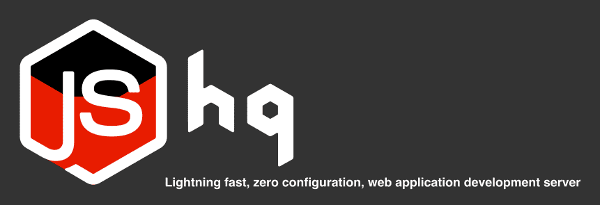

# 💫 One tool to rule them all
<p align="center">
  <a href="https://hqjs.org/" target="_blank">
    
  </a>
</p>

# Features

* 🎓 You already know it - it is just a static server that delivers your application code files
* 🏂 Zero configuration - one command and you are good to go
* 🏋️ Supports all kinds of frameworks: Polymer, Svelte, Vue, React, Angular and many others out of the box
* 😎 Understands all popular formats `.js`, `.jsx`, `.mjs`, `.es6`, `.svelte`, `.vue`, `.ts`, `.tsx`, `.coffee`, `.json`, `.css`, `.scss`, `.sass`, `.less`, `.html` and `.pug`
* 🎁️ Delivers without bundling to reflect project structure in the browser and make it easier to understand and develop
* 🦋 Makes debugging a pleasure - NO MORE missing sourcemaps and obfuscated bundles, situations when you can't put a breakpoint on the line or expression, ugly webpack names behind the code and empty debugging tooltips
* 🕸 Relies on the latest web standards - so you can use cutting edge features even if your browser lacks them
* ⚡ Light and fast - ships minimum that is required with no bundlers overhead, only the files you change are delivered

# VSCode extension

Get [Visual Studio Code Extension](https://marketplace.visualstudio.com/items?itemName=hqjs.hq-live-server) and run hq with single `Go Live` button click.

# Installation

Install it once with npm
```sh
npm install -g @hqjs/hq
```

# Usage
Run inside project root
```sh
hq
```
it will find your source code and serve it.

Make sure that you have `nodejs >= 8.9.0` and no unexpected `.babelrc`, `.postcssrc` or `.posthtmlrc` in a project root.
If problem occurs - please raise an [issue](https://github.com/hqjs/hq/issues).

# Why hq?

There are many development tools out there, including `browserify`, `webpack`, `rollup` and `parcel`, that provide development servers. But all of them rely on bundling. While bundling might still be usefull for production, it makes the development experience quite a struggle.

Without bundling `hq` dramatically increases development speed by shipping only files that were changed and improves debugging by providing minimal transformation to a source.

With `hq` you can start a new project instantly. Just type `hq` and you are ready for experiments. It supports all kinds of frameworks out of the box, so there is no need to learn all their different tools and know all the buzzwords.

It is worth to say that `hq` requires no configuration, offering the familiar experience of working with a regular static server.

# How it works

`hq` serves every file individually as requested, same way regular static server does. That gives you only very simple dead code elimination without proper tree shaking, but on the other hand a lot of time that was wasted for dependency analysis is being saved. All transforamtions are instant and performed on the fly during the first request. If you use modern browser and stick to the standard your code would hardly be changed at all.

While you try to follow the standards, you can't guarantee that all that libraries that you depend on will do the same. Most of them will probably use commonjs modules format and won't work in the browser just as they are. `hq` takes care of that as well and transforms commonjs modules into ESM, handles non standard, but pretty common imports (like css or json importing) and destructure importing objects when it is required.

`hq` will work tightly with the browser, using its cache system to speed up asset delivery and only delivers what has been changed. It will automatically reload the page when you modify the code so you will see the feedback immediatly.

It can work with many different frameworks, but does not rely on any of that frameworks' code in particular. Instead `hq` performs general ast transformations with `babel` through plugins that were designed for `hq` to help it understand all diversity of different technologies and technics used in those frameworks.

# Example

Let's say we have an existing angular project and want to improve development experience with `hq`.

All, we need to do is to add our global style file and script to the head and body of `index.html` correspondingly. So when `hq` serves index, it will serve styles and scripts as well
```html
<!doctype html>
<html lang="en">
<head>
  ...
  <link rel="stylesheet" href="/styles.css">
</head>
<body>
  <app-root></app-root>
  <script src="/main.ts"></script>
</body>
</html>
```

For most of the frameworks that is already enough, and you can skip the next step, but Angular requires a bit more attention. It depends on `zones` and `Reflect.metadata` APIs that are on very early stages and are not supported by `hq` out of the box. In fact angular includes them in file `polyfills.ts` and adds the file to your build. So we are going to import missing dependencies on top of `main.ts`
```js
import 'core-js/proposals/reflect-metadata';
import 'zone.js/dist/zone';
import 'zone.js/dist/zone-patch-canvas';
...
```

And that's it, now you are ready to start developing by running
```sh
hq
```
in the project root.

# Is it good for production?

Yes, it supports most of the projects in production mode (yet it is experimental at the moment, raise an [issue](https://github.com/hqjs/hq/issues) if you experience the problem). To activate production mode set `NODE_ENV` to production before running `hq`
```sh
NODE_ENV=production hq
```

# Does it support HTTP2?

Yes, it does. Drop your certificate and a key somewhere in the root of your project and `hq` will serve it trough HTTP2 e.g.
```
cert/server.pem
cert/server-key.pem
```

# More benefits with .babelrc, .postcssrc and .posthtmlrc

With `hq` you don't need to take care of babel, postcss or posthtml configuration, the **latest web standards** will be **supported out of the box**. However if you need to support a feature that does not have a common interpretation (like svg react imports) or experimental features from an early stage (like nested css), or you have your own plugins that only make sense in your project just add `.babelrc`, `.postcssrc` or `.posthtmlrc` configurations to the root of your project with the list of all desired plugins e.g.

`.babelrc`
```json
{
  "plugins": [
    "babel-plugin-transform-remove-console"
  ]
}
```
`.postcssrc`
```json
{
  "plugins": [
    ["postcss-nested", {"preserveEmpty": true}]
  ]
}
```
`.posthtmlrc`
```json
{
  "plugins": [
    ["posthtml-doctype", { "doctype" : "HTML 5" }],
    "posthtml-md"
  ]
}
```
and they will be automatically merged with `hq` configuration. Do not forget to install these additional plugins to your project before running `hq`.

# License

[MIT](LICENSE)
